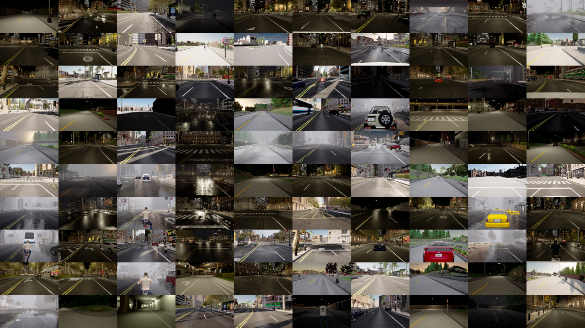
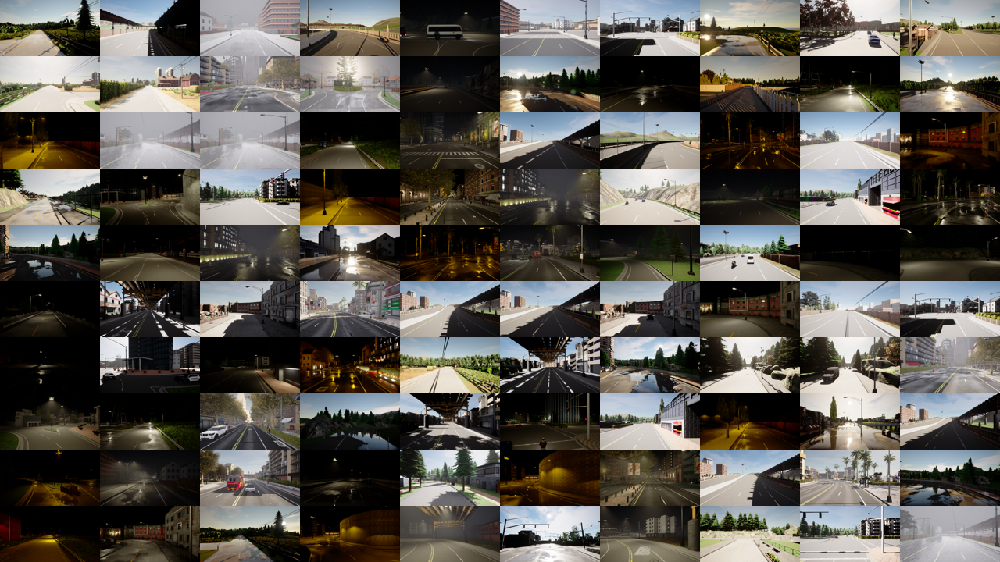

## Dataset organization

Our *LanEvil* dataset contains two subsets, i.e., a training set with normal images and a test set with environmental illusions.

### *LanEvil* training set

  

    
  

  

    Due to the fact that not all cases that appear in the real world have environmental illusions, we use the training set consisting of <b>40,000</b> randomly sampled images to help model training.
  

### *LanEvil* test set

  

    
  

  

    The test part consists of <b>50,292</b> images. For each basic environmental illusion, we provide an original case without any illusion and 2 - 10 perturbed cases, each consisting of 50 to 300 consecutively captured driving images.
  

 
 

<!-- html div盒子 -->

  

    
    

      The number of original and perturbed cases under four categories.
    

  

 
  

    
    

      The case distribution of four illusion categories.
    

  

