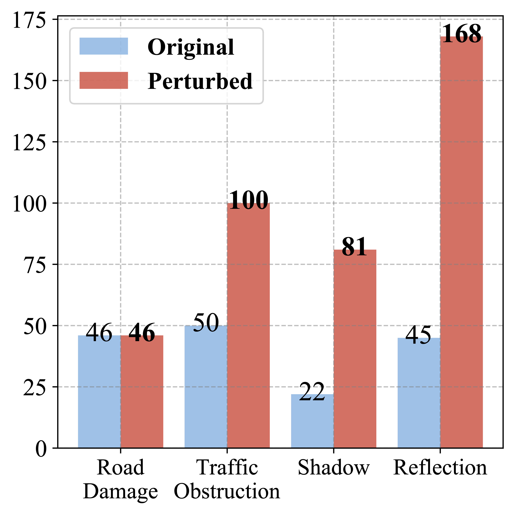
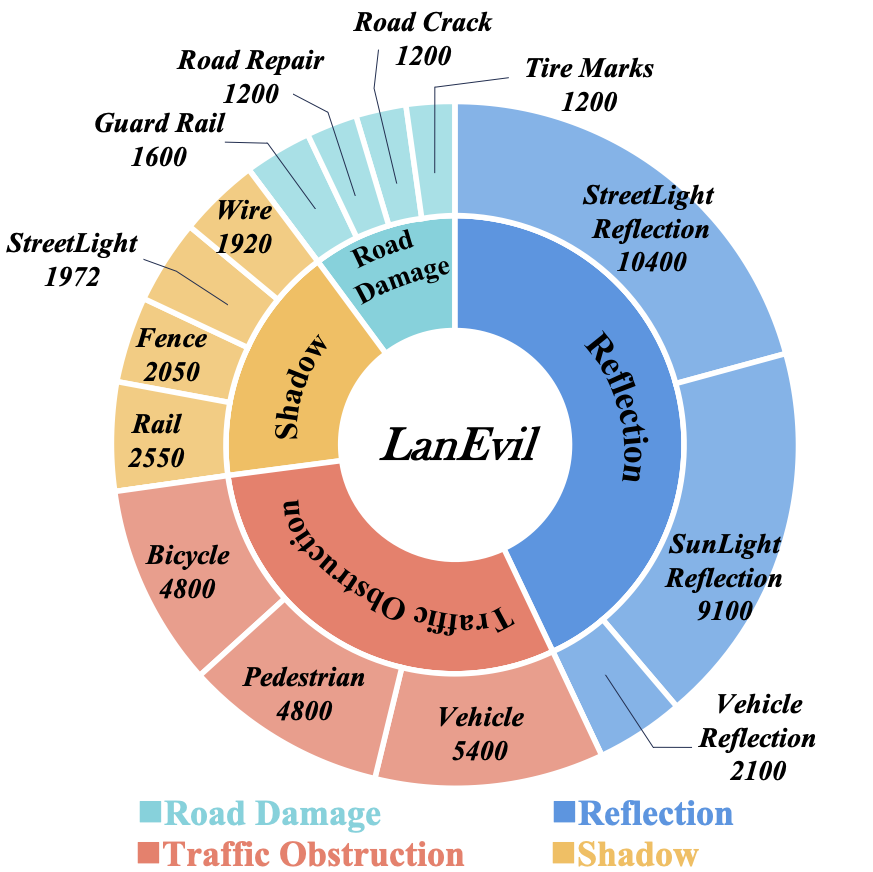

## Dataset organization

Our *LanEvil* dataset contains two subsets, i.e., a training set with normal images and a test set with environmental illusions. Due to the fact that not all cases that appear in the real world have environmental illusions, we use the training set consisting of **40,000** randomly sampled images to help model training.  The test part consists of **50,292** images. For each basic environmental illusion, we provide an original case without any illusion and 2 - 10 perturbed cases, each consisting of 50 to 300 consecutively captured driving images. The statistics of original and perturbed cases are shown in Figure \ref{fig:dataset_a} and Table \ref{tab:diversity_b}.

<!-- html div盒子 -->

  

    
  

 
  

    
  

## My story
To be honest, I'm having some trouble remembering right now, so why don't you just watch [my movie](https://en.wikipedia.org/wiki/The_Princess_Bride_%28film%29) and it will answer **all** your questions.
